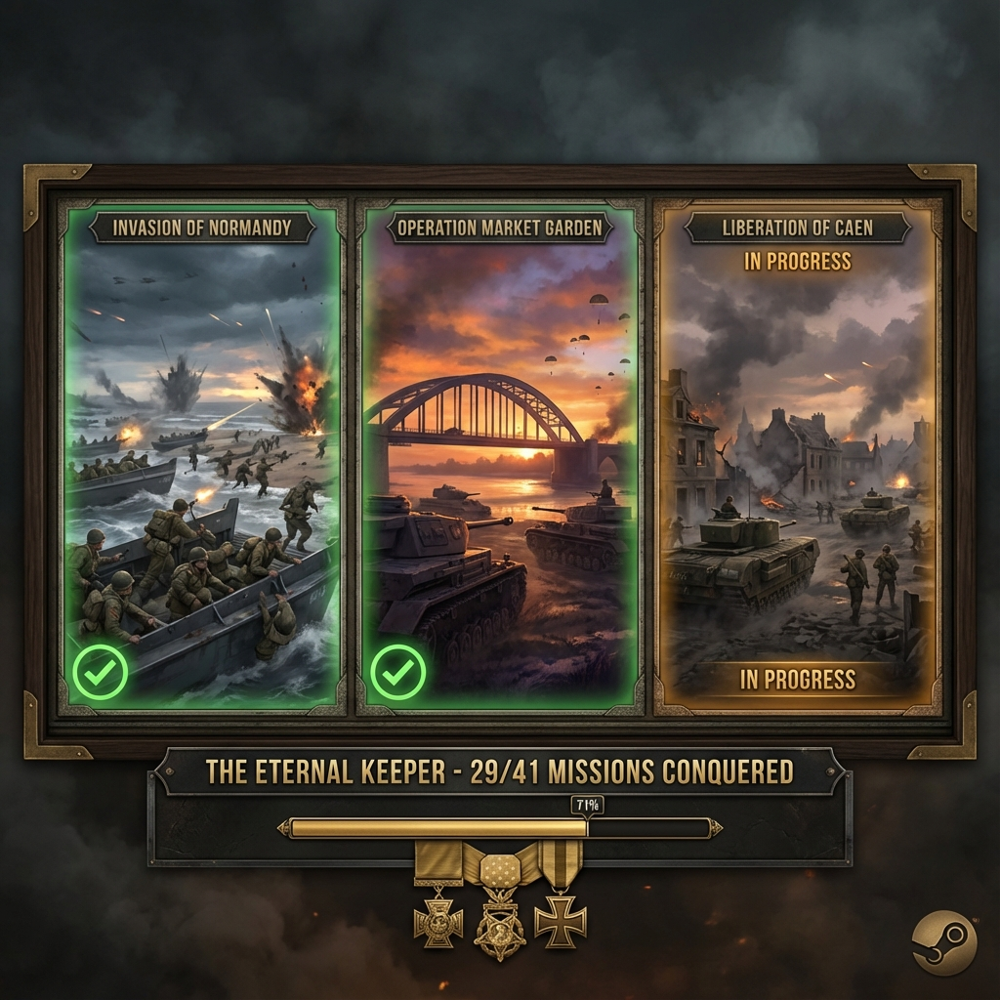

# Company of Heroes

| |                             |
|--------------------|-----------------------------|
| Release Date       | 11th September 2006 (Base Game) |
| Expansions         | Opposing Fronts (2007) Tales of Valor (2009) |
| Developer          | Relic Entertainment         |
| Publisher          | THQ / Sega                  |
| Genre              | RTS, World War II           |
| Status             | Active                      |
| Time Played        | 39h 33m                     |
| Rating             | TBD                         |
| Platform           | Steam                       |
| Achievements       | Not Available               |
| Steam Version      | Includes all content (Base + Opposing Fronts + Tales of Valor) |

*A tribute to my campaign through WWII's greatest battles. Four campaigns complete, two to go.*

## Overview

Company of Heroes is a real-time strategy game developed by Relic Entertainment that revolutionized the genre upon its release in 2006. Set during World War II, it moves away from traditional resource gathering, focusing instead on capturing control points and managing supply lines. The game is renowned for its cinematic presentation, destructible environments, and intense tactical combat.

**Expansions:**
- **Opposing Fronts (2007):** Added British and Panzer Elite factions with new campaigns
- **Tales of Valor (2009):** Introduced new units, abilities, and game modes

**Note:** The Steam version includes the base game and both expansions as one complete package.

*This review is in progress. I will update the playtime as I continue.*

## Story & Atmosphere

The campaign follows Able Company during the Battle of Normandy, starting with the D-Day landings at Omaha Beach and pushing through the French countryside. The narrative is grounded and gritty, capturing the chaos and heroism of the war. The atmosphere is immersive, with incredible sound design—from the rattle of machine guns to the shouting of soldiers—bringing the battlefield to life.

## Gameplay

Company of Heroes focuses on squad-level tactics and cover mechanics. Units must use the terrain to survive, and the environment itself is dynamic; buildings can be destroyed, leaving behind rubble that offers new cover. Managing resources (Manpower, Munitions, and Fuel) requires controlling territory on the map, forcing aggressive play. At 10 hours and 38 minutes, I am deep into the campaign and learning the nuances of flanking maneuvers and combined arms warfare.

## Walkthrough

📖 **[View Complete Walkthrough Guide](walkthroughs/company_of_heroes.md)**

A comprehensive guide covering all 41 missions across 6 campaigns:
- **Part 1:** Invasion of Normandy (US) - 15 missions
- **Part 2:** Operation Market Garden (Panzer Elite) - 8 missions
- **Part 3:** Liberation of Caen (British) - 9 missions
- **Part 4-6:** Tales of Valor (Tiger Ace, Causeway, Falaise Pocket) - 9 missions

**Current Progress:**
- ✅ Invasion of Normandy - COMPLETED (All medals earned! 🏅)
- ✅ Operation Market Garden - COMPLETED (All medals earned! 🏅)
- ✅ Liberation of Caen - COMPLETED (All medals earned! 🏅)
- ✅ Tiger Ace - COMPLETED (All medals earned! 🏅)
- ✅ Causeway - COMPLETED (All medals earned! 🏅)
- 🎮 Falaise Pocket - IN PROGRESS (Mission 1)
- **Overall:** 38/41 missions (93%)

## Verdict

Rating and Verdict are still on process. I don't know how much I like this game until i completed the game.
