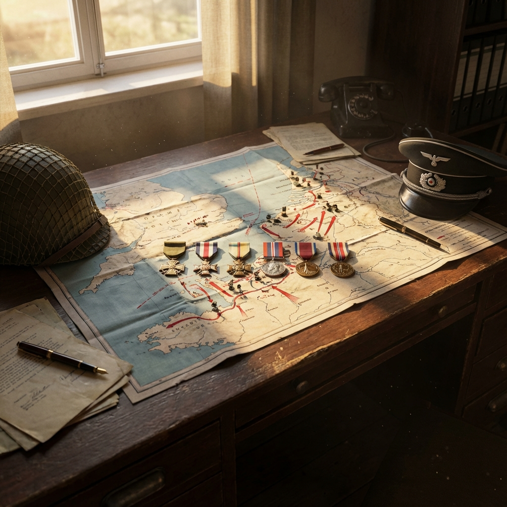

# Company of Heroes

| |                             |
|--------------------|-----------------------------|
| Release Date       | 11th Sep 2006               |
| Expansions         | Opposing Fronts (2007) Tales of Valor (2009) |
| Developer          | Relic Entertainment         |
| Publisher          | THQ / Sega                  |
| Genre              | RTS, World War II           |
| Status             | Completed                   |
| Time Played        | 40h 18m                     |
| Rating             | ★ ★ ★ ★ ★                 |
| Platform           | Steam                       |
| Achievements       | Not Available               |
| Steam Version      | Includes all content (Base + Opposing Fronts + Tales of Valor) |

*A tribute to my campaign through WWII's greatest battles. All six campaigns conquered, every medal earned.*

## Overview

Company of Heroes is a real-time strategy game developed by Relic Entertainment that revolutionized the genre upon its release in 2006. Set during World War II, it moves away from traditional resource gathering, focusing instead on capturing control points and managing supply lines. The game is renowned for its cinematic presentation, destructible environments, and intense tactical combat.

**Expansions:**
- **Opposing Fronts (2007):** Added British and Panzer Elite factions with new campaigns
- **Tales of Valor (2009):** Introduced new units, abilities, and game modes

**Note:** The Steam version includes the base game and both expansions as one complete package.

## Story & Atmosphere

The campaign follows Able Company during the Battle of Normandy, starting with the D-Day landings at Omaha Beach and pushing through the French countryside. The narrative is grounded and gritty, capturing the chaos and heroism of the war. The atmosphere is immersive, with incredible sound design—from the rattle of machine guns to the shouting of soldiers—bringing the battlefield to life.

## Gameplay

Company of Heroes focuses on squad-level tactics and cover mechanics. Units must use the terrain to survive, and the environment itself is dynamic; buildings can be destroyed, leaving behind rubble that offers new cover. Managing resources (Manpower, Munitions, and Fuel) requires controlling territory on the map, forcing aggressive play. Throughout the 40+ hour campaign, mastering flanking maneuvers, combined arms warfare, and the specific strengths of each faction (US, British, Panzer Elite) was essential to victory.

## Walkthrough

📖 **[View Complete Walkthrough Guide](walkthroughs/company_of_heroes.md)**

A comprehensive guide covering all 41 missions across 6 campaigns:
- **Part 1:** Invasion of Normandy (US) - 15 missions
- **Part 2:** Operation Market Garden (Panzer Elite) - 8 missions
- **Part 3:** Liberation of Caen (British) - 9 missions
- **Part 4-6:** Tales of Valor (Tiger Ace, Causeway, Falaise Pocket) - 9 missions

**Current Progress:**
- ✅ Invasion of Normandy - COMPLETED (All medals earned! 🏅)
- ✅ Operation Market Garden - COMPLETED (All medals earned! 🏅)
- ✅ Liberation of Caen - COMPLETED (All medals earned! 🏅)
- ✅ Tiger Ace - COMPLETED (All medals earned! 🏅)
- ✅ Causeway - COMPLETED (All medals earned! 🏅)
- ✅ Falaise Pocket - COMPLETED (All medals earned! 🏅)
- **Overall:** 41/41 missions (100%)

## Verdict

After 40 hours and 18 minutes of intense tactical warfare, Company of Heroes stands as the definitive World War II RTS experience. It is a masterpiece that completely redefined expectations for the genre. Completing all six campaigns and earning every single medal was a challenge of patience, strategy, and execution, but one that felt incredibly rewarding.

### The Good
*   **Tactical Depth:** It's not just about building the biggest army. It's about positioning, cover, flanking, and using the right tool for the job. A single well-placed machine gun or AT gun can hold off an entire advance.
*   **Atmosphere:** The sound design is phenomenal. The chatter of soldiers, the terrifying screech of incoming artillery, and the roar of tank engines create an immersive battlefield.
*   **Destructible Environments:** seeing a quiet French town turned into rubble over the course of a battle isn't just a visual effect; it changes the gameplay dynamic, creating new cover and lines of sight.
*   **Campaign Variety:** The three factions (US, Panzer Elite, British) play distinctly differently. The defensive nature of the British, the mobility of the Panzer Elite, and the versatility of the Americans kept the gameplay fresh across 41 missions.

### The Bad
*   **Pathfinding:** occasionally, units (especially tanks) would get stuck or take questionable routes, requiring micromanagement.
*   **Age:** While it holds up beautifully, some older campaign scripts can be slightly buggy, though nothing game-breaking.

### Final Thoughts
Company of Heroes proves that RTS games can have cinematic storytelling and deep, meaningful choices. It perfectly balances macro-management (resources/bases) with micro-management (squad tactics). For anyone who appreciates strategy, history, or just excellent game design, this is an absolute must-play. Earning 100% completion wasn't a grind—it was a privilege.

**Rating:** ★ ★ ★ ★ ★ (Legendary Artifact)
