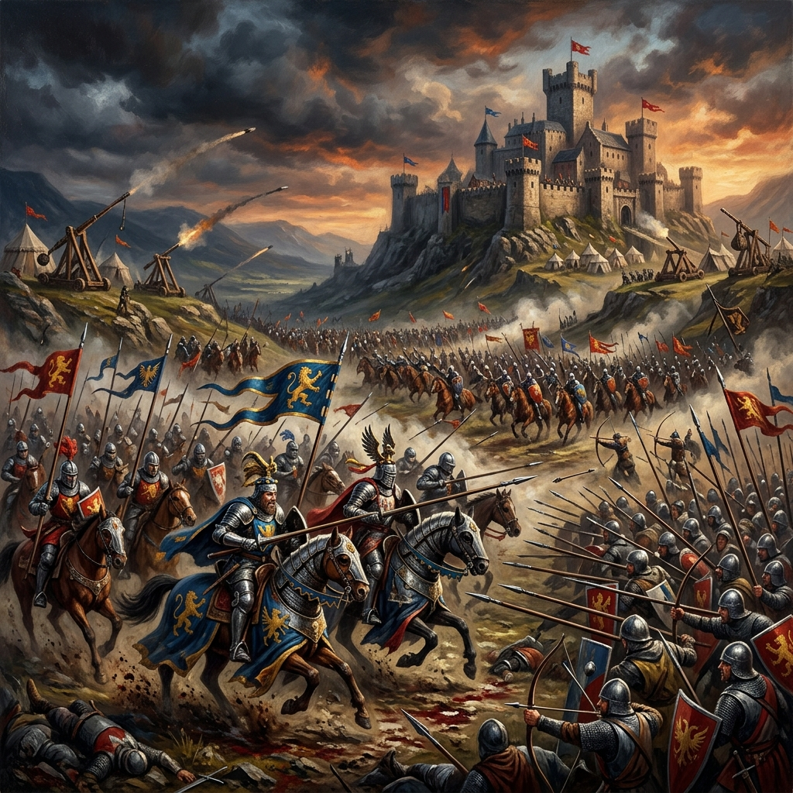

# Age of Empires II

| |                             |
|--------------------|-----------------------------| 
| Release Date       | 30th Sep 1999 (Original) / 14th Nov 2019 (Definitive Edition) |
| Developer          | Ensemble Studios / Forgotten Empires |
| Publisher          | Microsoft Game Studios / Xbox Game Studios |
| Genre              | Real-Time Strategy (RTS)    |
| Status             | Playing                     |
| Time Played        | 0h 00m                      |
| Start Date         | 30th June 2026              |
| End Date           | -                           |
| Duration           | -                           |
| Rating             | -                           |
| Platform           | Steam                       |
| Achievements       | 0/170 (0%)                  |

## Overview

Age of Empires II is the legendary real-time strategy masterpiece that defined the genre for generations. Spanning over a thousand years of history, players guide one of dozens of civilizations from the Dark Age to the Imperial Age, gathering resources, building mighty empires, and commanding grand armies. Re-released in 2019 as the Definitive Edition, it brings modern 4K visuals, fully remastered audio, quality-of-life updates, and a suite of fresh content to the ultimate historical RTS experience.

## Story & Atmosphere

*(To be filled as I play)*

## Gameplay

*(To be filled as I play)*

## Verdict

*(To be filled upon completion)*

---

## Campaign Progress

*(Tracking my journey through the grand campaigns)*

- [ ] **Learning Campaign: William Wallace (Celt)**
- [ ] **Joan of Arc (Franks)**
- [ ] **Saladin (Saracens)**
- [ ] **Barbarossa (Teutons)**
- [ ] **Genghis Khan (Mongols)**

## Notes & Observations

*(These are my raw notes from while I was playing—some spoilers involved!)*

### First Impressions
*   **A Classic Reborn:** The Definitive Edition looks absolutely gorgeous. The asset resolution, the grid system, and the fluid building collapse animations breathe incredible life into the classic medieval aesthetic.
*   **Ready to Conquer:** Looking forward to diving back into the classic historical campaigns and matching the strategic challenges of base building and combat against the AI.
