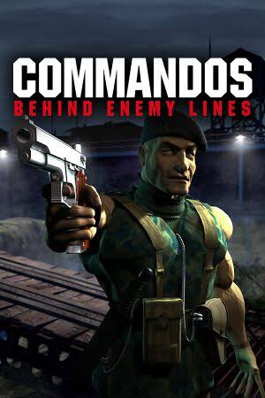

# Commandos: Behind Enemy Lines

| |                             |
|--------------------|-----------------------------| 
| Release Date       | 28th June 1998              |
| Developer          | Pyro Studios                |
| Publisher          | Eidos Interactive           |
| Genre              | Real-Time Tactics, Stealth, World War II |
| Status             | Playing                     |
| Time Played        | 2h 01m                      |
| Supervisor         | Colonel Montague Smith      |
| Start Date         | 1st July 2026               |
| End Date           | -                           |
| Duration           | -                           |
| Rating             | -                           |
| Platform           | Steam                       |
| Achievements       | Not Available               |

## Overview

Commandos: Behind Enemy Lines is the legendary real-time tactics game that defined the tactical stealth genre. Set during World War II, players take command of a small squad of elite Allied soldiers—each with unique and specialized skills—to complete dangerous covert missions behind enemy lines. Known for its punishing difficulty, isometric perspective, and detailed pre-rendered levels, it requires extreme planning, coordination, and split-second execution to slip past patrols, sabotage military targets, and escape unnoticed.

## Story & Atmosphere

*(To be filled as I play)*

## Gameplay

*(To be filled as I play)*

## Verdict

*(To be filled upon completion)*

---

## Mission Progress

*(Tracking my journey through the game)*

- [x] **Baptism of Fire (Mission 1 — Norway)**
- [x] **A Quiet Blow-up (Mission 2 — Norway)**
- [ ] **Reverse Engineering (Mission 3 — Norway)**
- [ ] **Restore Pride (Mission 4 — Norway)**
- [ ] **Blind Justice (Mission 5 — Norway)**
- [ ] **Menace of the Leopold (Mission 6 — North Africa)**
- [ ] **Chase of the Wolves (Mission 7 — North Africa)**
- [ ] **Pyrotechnics (Mission 8 — North Africa)**
- [ ] **A Courtesy Call (Mission 9 — North Africa)**
- [ ] **Operation Icarus (Mission 10 — North Africa)**
- [ ] **In the Soup (Mission 11 — North Africa)**
- [ ] **Up on the Roof (Mission 12 — North Africa)**
- [ ] **David and Goliath (Mission 13 — France)**
- [ ] **D-Day Kick Off (Mission 14 — France)**
- [ ] **The End of the Butcher (Mission 15 — France)**
- [ ] **Stop Wildfire (Mission 16 — Germany)**
- [ ] **Before Dawn (Mission 17 — Germany)**
- [ ] **The Force of Circumstance (Mission 18 — Germany)**
- [ ] **Frustrate Retaliation (Mission 19 — Germany)**
- [ ] **Operation Valhalla (Mission 20 — Germany)**

---

## Notes & Observations

*(These are my raw notes from while I was playing—some spoilers involved!)*

### 🇳🇴 Norway

*   **Baptism of Fire (Mission 1):** The Colonel tasked us with hitting the German occupiers where it hurts. Our objective: destroy the Relay Tower in Stavanger to cripple their reinforcement capabilities in the Northern Sea Range.
    *   **The Squad:** Tiny (Green Beret), Fins (Marine), and Tread (Driver).
    *   **The Infiltration:** We started scattered across the shore. First order of business was regrouping. Fins swam out stealthily with his diving gear, hijacking an inflatable boat to ferry Tiny and Tread across the freezing waters.
    *   **The Run:** Tiny used his decoy to distract patrols, crept up behind them, and eliminated them silently with his combat knife. The vision cones in this game are incredibly tight—one step in the bright green zone and alarms start blaring.
    *   **The Boom:** After clearing the perimeter, Tiny placed explosives next to the fuel barrels near the relay station. The explosion was majestic, lighting up the night. We slipped away in our boat before they knew what hit them.
    *   **The Ranking:** Corporal — A solid start, but the Colonel expects perfection.

*   **A Quiet Blow-up (Mission 2):** Operation Claymore is officially approved—our first medium-scale incursion. We had to neutralize industrial fuel facilities and merchant ships in the Stamsund area of the Lofoten islands.
    *   **The Squad:** Tiny (Green Beret), Fins (Marine), Tread (Driver), Duke (Sniper), and Inferno (Sapper).
    *   **The Obstacle:** The Storfjord camp was heavily fortified, patrolled by a German gunboat that would shred us in seconds if spotted. Fins had to time his swims perfectly.
    *   **The Setup:** Duke was the MVP of the early phase. With extremely limited sniper ammo, he made every shot count, picking off watchtower guards so Tiny could carry and hide their bodies to avoid alerting the barracks.
    *   **The Hit:** Inferno (Sapper) did what he does best: set charges on the fuel depots in the northern camp.
    *   **The Escape:** Tread hotwired a German truck, the squad piled in, and we broke through the southwest roadblock to extract.
    *   **The Ranking:** Corporal — The difficulty spike here was real. Synchronizing five specialists takes serious patience.

### First Impressions
*   **The Genesis of Tactics:** It's fascinating to experience the grandfather of *Desperados*. The mechanics are purer and even more punishing, showing where the blueprint for real-time tactical stealth truly came from.
*   **Highly Unforgiving:** The line of sight and hearing systems are incredibly precise. One mistake triggers the alarm, making quicksaving my absolute best friend.
*   **Elite Specialists:** Managing the Green Beret, Sniper, Marine, and others feels like solving a complex, high-stakes puzzle where everyone must play their role perfectly.
