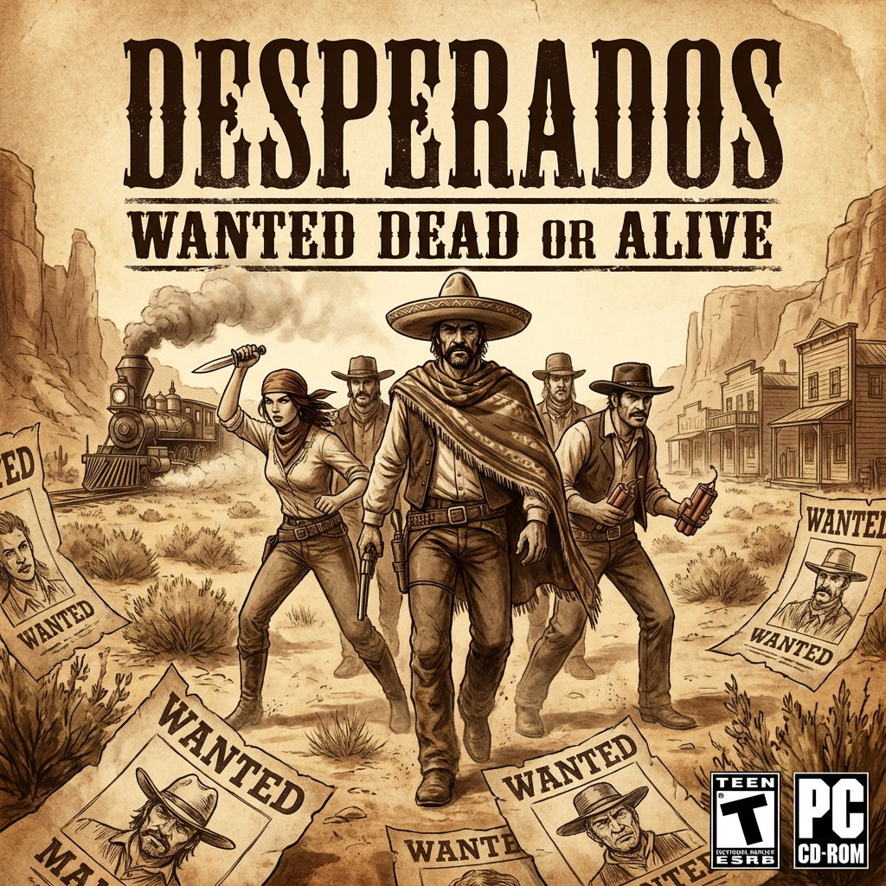

# Desperados: Wanted Dead or Alive

| |                             |
|--------------------|-----------------------------| 
| Release Date       | 23rd Jul 2001               |
| Developer          | Spellbound Entertainment    |
| Publisher          | Infogrames                  |
| Genre              | Real-Time Tactics, Stealth  |
| Status             | Completed                   |
| Time Played        | 7 Hours 10 Minutes          |
| Rating             | ★ ★ ★ ★ ☆                 |
| Platform           | Pirated                     |
| Achievements       | Pirated                     |

## Overview

Desperados: Wanted Dead or Alive is a real-time tactics game set in the Wild West, where precision, patience, and planning matter far more than quick reflexes. Released in 2001, it's a spiritual successor to the Commandos series, trading World War II battlefields for dusty frontier towns, bandit camps, and sun-scorched deserts. Over the course of 7 hours, I commanded a ragtag group of outlaws and lawmen through increasingly complex missions that demanded careful observation, creative problem-solving, and near-perfect execution.

## Story & Atmosphere

The story follows John Cooper, a bounty hunter tasked with tracking down the notorious bandit El Diablo. Along the way, he recruits a colorful cast of specialists — a gunslinger, a demolitions expert, a seductive showgirl, a knife-throwing Mexican, and a grizzled old trapper. The narrative is straightforward, almost pulpy, but it serves its purpose: giving context to the missions and justifying why this unlikely crew works together.

The atmosphere is where Desperados truly shines. The Wild West setting is brought to life with dusty towns, creaking saloons, moonlit canyons, and train robberies straight out of a classic Western film. The isometric visuals, while dated by modern standards, have a certain charm — detailed enough to convey the harshness of the frontier, yet stylized enough to remain timeless. The soundtrack, filled with twangy guitars and ominous strings, perfectly complements the tension of sneaking past guards or setting up the perfect ambush.

## Gameplay

Desperados is unforgiving in the best way. Each mission is a puzzle where you control multiple characters, each with unique abilities. Cooper can throw knives and use his revolver; Doc McCoy can heal and use a sniper rifle; Sam Williams can punch enemies unconscious or use dynamite; Kate O'Hara can distract guards with her charm; and Sanchez can throw knives with deadly precision. Success requires using these abilities in tandem — distracting a guard while another character sneaks behind for a silent takedown, or coordinating simultaneous kills to avoid raising alarms.

The level design is intricate, offering multiple paths and solutions. Some missions can be completed with pure stealth, while others demand calculated aggression. The game rewards experimentation and punishes carelessness — one wrong move can alert an entire camp, forcing a reload. Quicksave becomes your best friend, and trial-and-error is part of the experience.

However, the difficulty can be brutal, especially for newcomers. The controls, while functional, feel clunky by modern standards. Pathfinding can be frustrating, and the AI, though competent, occasionally behaves unpredictably. Some missions drag on longer than necessary, testing patience more than skill.

## Verdict

After 7 hours, Desperados: Wanted Dead or Alive stands as a challenging and rewarding tactical experience that captures the essence of the Wild West through clever gameplay and atmosphere. It's a game that demands your full attention and rewards careful planning with moments of pure satisfaction — watching a perfectly executed plan unfold is immensely gratifying.

It's not without its rough edges. The controls feel dated, the difficulty spikes can be punishing, and some missions overstay their welcome. But for those willing to embrace its methodical pace and unforgiving nature, Desperados offers a unique blend of strategy, stealth, and Western charm that few games have replicated since. It's a testament to how tactical depth and atmosphere can create a memorable experience, even when the mechanics show their age.
