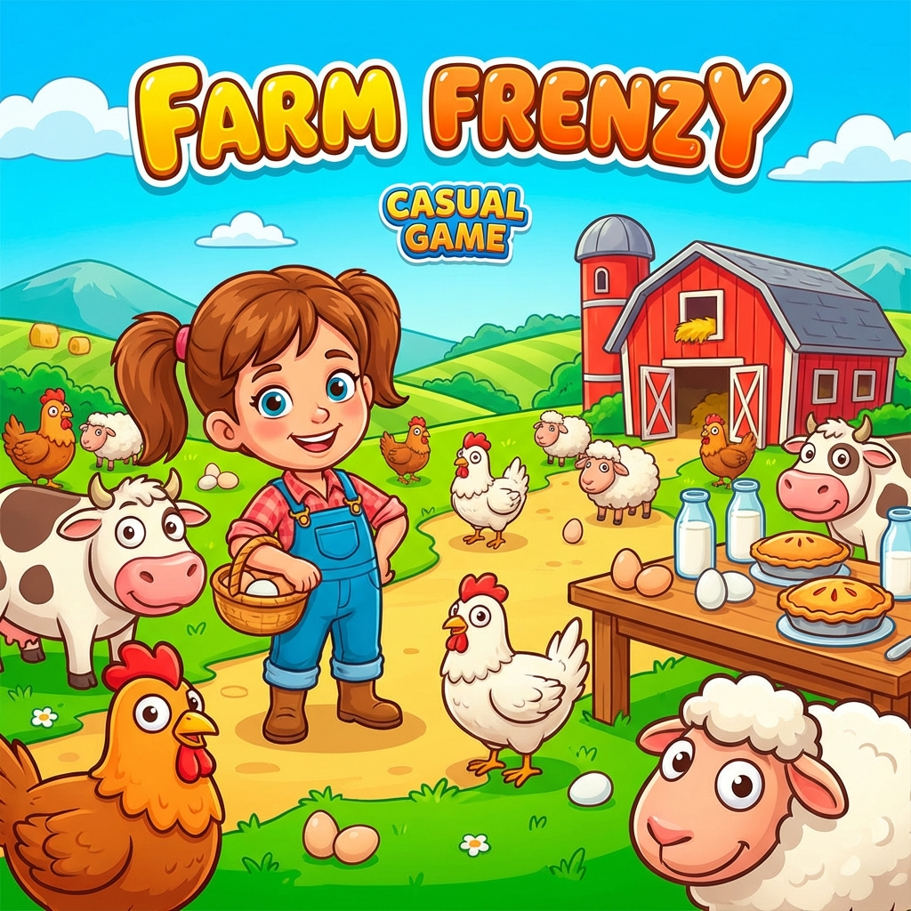

# Farm Frenzy

| |                             |
|--------------------|-----------------------------| 
| Release Date       | 7th Dec 2007                |
| Developer          | Melesta Games               |
| Publisher          | Alawar Entertainment        |
| Genre              | Time Management, Casual     |
| Status             | Completed                   |
| Time Played        | 9 Hours 38 Minutes          |
| Rating             | ★ ★ ⯪ ☆ ☆                 |
| Platform           | Pirated                     |
| Achievements       | Pirated                     |

## Overview

Farm Frenzy is a time management game that puts you in the role of a farmer tasked with raising animals, collecting produce, and selling goods to earn money. Released in 2007, it rode the wave of casual gaming popularity that defined that era — simple mechanics, colorful graphics, and a gameplay loop designed for quick sessions. On paper, it's a charming concept: build your farm empire one egg at a time. In practice, after nearly 10 hours, the charm wore thin faster than I expected.

## Story & Atmosphere

There's barely a story here, and that's not necessarily a problem for a casual time management game. You're a farmer. You have goals. You complete them. The game doesn't pretend to be anything more. The atmosphere is bright, cheerful, and cartoonish — animals bounce around, products pop into existence with satisfying sound effects, and everything has that early-2000s Flash game aesthetic. It's inoffensive and mildly pleasant, but it lacks personality. There's no world-building, no character, no reason to care beyond the next level's star rating.

## Gameplay

The core loop is straightforward: buy animals (chickens, sheep, cows), collect their products (eggs, wool, milk), process them into goods (cakes, yarn, cheese), and sell them for profit. You also need to manage predators (bears) that occasionally show up to wreak havoc, which you cage and sell for extra cash. Between levels, you upgrade your equipment — faster wells, bigger warehouses, more efficient processing machines.

For the first few hours, this loop has a certain rhythm. There's satisfaction in optimizing your farm layout, timing your upgrades, and chasing three-star ratings on each level. But the cracks start showing quickly. The difficulty curve is inconsistent — some levels feel trivially easy, while others spike in frustration due to tight time limits or resource scarcity. The game doesn't introduce enough new mechanics to keep things fresh; by the halfway point, you're doing the same tasks with slightly different numbers.

The controls are simple — point, click, repeat — but they can feel imprecise when things get hectic. Clicking on the right animal or product in a crowded pen becomes a test of patience rather than skill. The game also suffers from a lack of strategic depth. Once you figure out the optimal upgrade path and production chain, every level becomes a matter of execution rather than experimentation.

## Verdict

After 9 hours and 38 minutes, Farm Frenzy feels like a relic of its time — a casual game that was probably perfect for short bursts on a mid-2000s PC, but struggles to hold attention in longer sessions. It's not broken, and it's not without its moments of satisfaction, but it's also repetitive, shallow, and ultimately forgettable.

The game doesn't respect your time. Levels drag on longer than they need to, the difficulty feels arbitrary, and there's little incentive to replay beyond completionism. For a time management game, it ironically wastes too much of yours. If you're looking for a nostalgic trip back to the casual gaming boom of the late 2000s, Farm Frenzy might scratch that itch. But if you're hoping for depth, variety, or lasting engagement, you'll find the well runs dry long before the final level.
