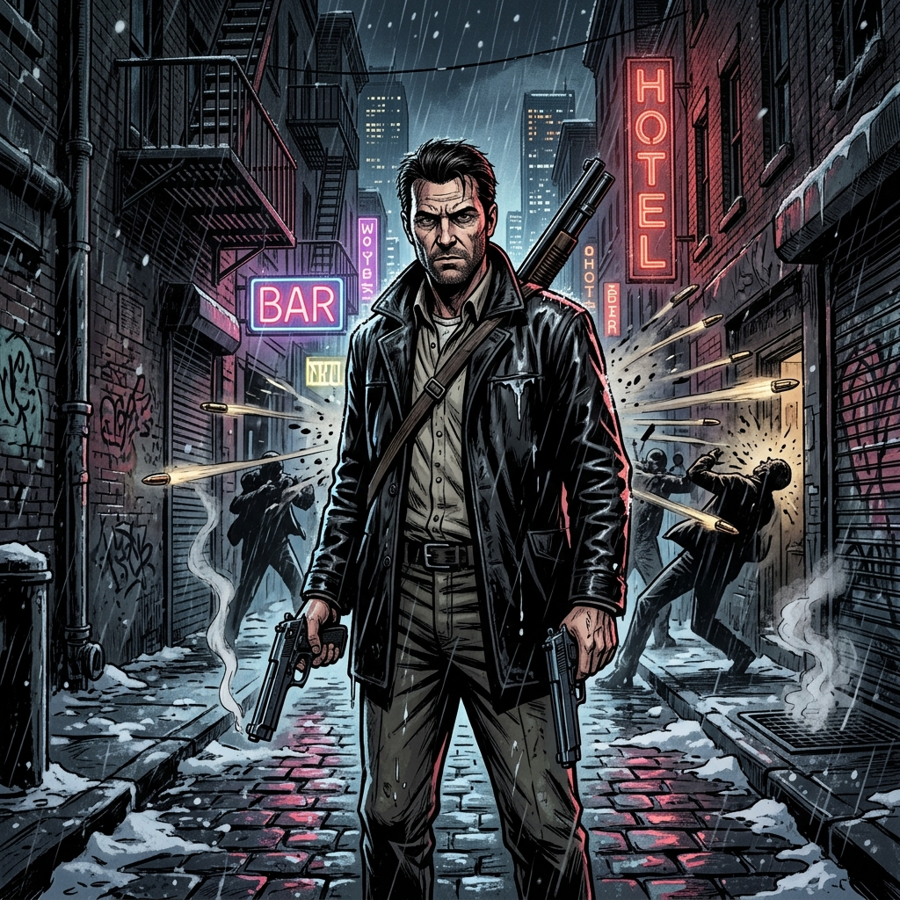

# Max Payne

| |                             |
|--------------------|-----------------------------| 
| Release Date       | 23rd July 2001              |
| Developer          | Remedy Entertainment        |
| Publisher          | Gathering of Developers / Rockstar Games |
| Genre              | Third-Person Shooter / Action / Film Noir |
| Status             | On Hold                     |
| Time Played        | 0h 00m                      |
| Start Date         | 30th June 2026              |
| End Date           | -                           |
| Duration           | -                           |
| Rating             | -                           |
| Platform           | Pirated                     |
| Achievements       | Not Available               |

## Overview

Max Payne is a ground-breaking third-person action shooter that introduced the concept of bullet-time to the video game industry. Developed by Remedy Entertainment and written by Sam Lake, the game tells the tragic story of a fugitive DEA agent and former NYPD officer on a revenge mission in a snow-covered, crime-ridden New York City after his family is murdered by junkies hooked on a designer drug called Valkyr. Blending Hong Kong action cinema style shootouts with classic hard-boiled detective noir storytelling, the game is renowned for its dark tone, graphic novel-style comic panels, and tragic narrative.

## Story & Atmosphere

*(To be filled as I play)*

## Gameplay

*(To be filled as I play)*

## Verdict

*(To be filled upon completion)*

---

## Notes & Observations

*(These are my raw notes from while I was playing—some spoilers involved!)*

### First Impressions
*   **A Noir Masterpiece:** The dark, gritty comic panels and Max's cynical, metaphor-heavy monologues create an unmatched atmosphere. New York feels cold, hostile, and beautiful in its decay.
*   **Bullet-Time Ballet:** The slow-motion shootouts are incredibly satisfying. Dodging bullets while firing dual Berettas feels just as cinematic today as it did in 2001.
*   **Challenging Combat:** The enemies are accurate and lethal, making tactical use of cover, positioning, and bullet-time essential for survival.
