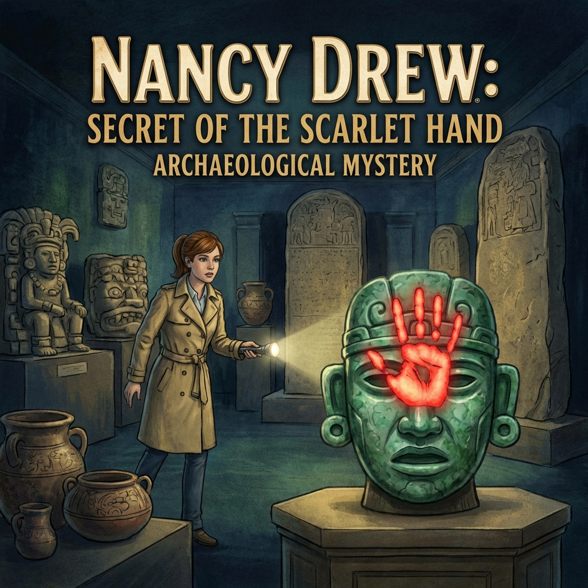

# Nancy Drew: Secret of the Scarlet Hand

| |                             |
|--------------------|-----------------------------| 
| Release Date       | 12th November 2002          |
| Developer          | Her Interactive             |
| Publisher          | Her Interactive             |
| Genre              | Adventure / Mystery         |
| Status             | Playing                     |
| Time Played        | 8h 7m                       |
| Start Date         | 15th January 2026           |
| End Date           | -                           |
| Duration           | -                           |
| Rating             | -                           |
| Platform           | Steam                       |
| Achievements       | Not Available               |

## Overview

Nancy Drew: Secret of the Scarlet Hand is the sixth installment in the Nancy Drew PC game series by Her Interactive. You play as Nancy Drew, a teenage detective who takes on an internship at the Beech Hill Museum in Washington D.C. What starts as a routine museum job quickly turns into a thrilling mystery when a priceless Mayan artifact is stolen, marked by a mysterious red handprint—the signature of the legendary "Scarlet Hand."

## Story & Atmosphere

The game opens with Nancy Drew arriving at the prestigious **Beech Hill Museum** in Washington D.C. for what should be a straightforward internship. Instead, she walks into a crime scene: a priceless jade carving of **King Pacal** has been stolen, and the thief left behind a dramatic calling card—a **red handprint** made from **Cinnabar** (mercury sulfide), the same toxic pigment the ancient Maya used to highlight their sacred carvings.

The atmosphere is steeped in Maya history and mythology. The museum itself feels like a crash course in ancient Mesoamerican culture, with artifacts, glyphs, and references to gods like **Itzamna** (the supreme creator), **Ixchel** (the dual-natured moon goddess), **Ahau Kin** (the sun god who transforms into a jaguar at night), and **Xbalanque** (the legendary Hero Twin). The game doesn't just use Maya culture as window dressing—it weaves it into the mystery itself, making you feel like you're uncovering layers of both ancient and modern secrets.

You'll work under **Joanna Riggs**, the museum curator who radiates "rigid academic" energy and cares deeply about the museum's reputation. Your workspace once belonged to **Sonny Joon**, a previous intern with a reputation for being "wacky" and obsessed with aliens—his doodles and notes are scattered around, adding a quirky layer to the mystery. The game balances educational content with engaging detective work, turning the museum into both a classroom and a crime scene.

## Gameplay

**Secret of the Scarlet Hand** is a classic first-person point-and-click adventure. You navigate the museum by clicking on hotspots, examining artifacts, solving puzzles, and talking to NPCs. The game has a **non-linear structure**, meaning you can tackle many tasks in whatever order you prefer, though some puzzles naturally gate your progress.

The puzzles are varied and often educational. You'll decipher **Maya glyphs**, solve **number puzzles** based on the ancient Maya counting system, assemble a **broken vase** (a surprisingly meditative task), and investigate clues left behind by the mysterious thief. The game does an excellent job of integrating its puzzles with the Maya theme—you're not just solving arbitrary riddles; you're learning about the **Tzolkin calendar**, the significance of gods like **Balac** (the war god) and **Ekahau** (the traveler and cacao god), and the divine right of Maya kings.

You'll interact with several NPCs, including **Joanna Riggs** (the curator), **Henrik Van Der Hune** (a Mayan expert), **Alejandro del Rio** (a museum employee), and **Taylor Sinclair** (the intern coordinator). Nancy's desk in the lab serves as your main quest tracker, with a to-do list that updates as you progress.

The game offers two difficulty modes: **Junior Detective** (more hints, easier puzzles) and **Senior Detective** (fewer hints, harder challenges). 

**Technical Note:** The game shows its age—it was released in 2002, and the graphics are rough by modern standards. Using **DGVoodoo2** to force a resolution bump from 640x480 to 1920x1080 results in a stretched widescreen image with distorted, hard-to-read text. It's playable, but not pretty. That said, the nostalgic charm and engaging mystery make it worth pushing through the visual roughness.

## Verdict

*(To be written upon completion)*

---

## Task Progress

*(Tracking my journey through the game)*

Nancy's to-do list at her desk in the lab serves as the main quest tracker. Key tasks include:

- [ ] Explore the Beech Hill Museum
- [ ] Assemble the broken vase
- [ ] Bring document to Mexican consulate
- [ ] Acquire headphones
- [ ] Solve Mayan number puzzles
- [ ] Investigate the theft
- [ ] Find the Scarlet Hand

## Notes & Observations

*(These are my raw notes from while I was playing—some spoilers involved!)*

### 🖥️ Technical & Visual Impressions
*   **Graphics & Age:** The game definitely shows its age (2002). The graphics are a bit "horrible" by modern standards, but that's the charm of retro gaming.
*   **Resolution Struggles:** I managed to forcefully enhance the resolution from 600x400 to 1920x1080 using **DGVoodoo2**. It worked... sort of. The game just became a wide-screen stretch, and the in-game text is highly distorted and tough to read.
*   **Nostalgic Drive:** Despite the technical headaches and visual roughness, I'm pushing forward. I grew up watching my brother play this, and I never had the chance to play it myself until now. That nostalgia is a powerful motivator to see this through.

### 🏛️ The Museum & The Maya
*   **Meeting the Boss:** Finally met **Joanna Riggs**, the curator. She’s giving major "rigid academic" energy—cares more about her reputation than breathing. Her office is a flex, though: massive photo of the **Great Plaza of Tikal** and shelves overflowing with artifacts.
*   **Crash Course in Mythology:** The game is basically a Maya history lesson in disguise, and I’m here for it. The god roster is stacked:
    *   **Itzamna (The Big Boss):** Supreme God, Lord of the Heavens. Name literally means "Lizard House" (weird flex, but okay). He invented writing and the calendar. Also, apparently the husband of Ixchel.
    *   **Ixchel (Moon Goddess):** Major duality vibes here. She’s the goddess of the moon, medicine, and weaving, but can also bring storms and destruction. She’s often depicted with a snake in her hair.
    *   **Ahau Kin (Sun God):** "Sun-faced Lord." He travels the sky by day and turns into a JAGUAR at night to prowl the underworld. That is objectively the coolest commute ever.
    *   **Chac (Rain God):** The storm bringer. Vital for crops, but scary if you’re caught in his weather.
    *   **Ekahau (Traveler’s God):** Also the god of **Cacao** (Chocolate!). Merchants loved him. He’s often shown with a black face or stripes. Guide me through this museum, cocoa king.
    *   **Yum Kaax (Lord of the Forest):** Guardian of wild plants and animals. Hunters had to ask his permission before taking game. Respect nature, or else.
    *   **Balac (War God):** The scary one. Found an **Offering Bowl** dedicated to him (dating to ca. 850 CE). Deciphered the glyph "Ek" (Black) on it.
    *   **Xbalanque (Jaguar God):** One of the "Hero Twins" from the *Popol Vuh*. He defeated the lords of the underworld in a ball game. Absolute legend.
*   **Time & Power:** The lore goes deep.
    *   **The Calendar:** The famous **Tzolkin calendar** isn't just a calendar; it's a sacred count computing a **260-day ceremonial year**.
    *   **Divine Right:** Maya Kings weren't just political or military leaders; they were essentially religious icons, believed to be handpicked by Itzamna himself.
    *   **Girl Power:** Here's a cool detail—the Supreme God didn't *only* pick dudes. There were female rulers too! The most famous one was **Lady Kanal Ikal**, who held the throne for a solid 20 years. Respect.

### 📜 Pacal the Great (The King of Kings)
I went down a massive rabbit hole on **K'Inich Janahb' Pacal**, aka **Lord Shield**. This guy is the main character of Maya history.
*   **The Prodigy:** He took the throne at **age 12** (615 CE). I was playing with toys at 12; he was ruling a civilization.
*   **The Reign:** Ruled for **68 years** (until 683 CE). That’s Queen Elizabeth II levels of longevity.
*   **The Nepo-Baby (Kind of):** His mom, **Lady Zac Kuk**, was the ruler before him. She passed the throne to him and then "ascended to deityhood." Power move.
*   **The Renaissance Man:** He wasn’t just a king; he was a **Priest-King** and a military commander. He rebuilt Palenque into the architectural masterpiece it is today.
*   **The Sarcophagus:** His tomb in the **Temple of the Inscriptions** is legendary.
    *   **The Lid:** The carving on his sarcophagus lid is famous. Some people think it looks like he’s piloting a spaceship ("Ancient Aliens," anyone?), but it’s actually depicting his descent into the underworld and rebirth as the Maize God.
    *   **The Jade Mask:** He was buried with a death mask made of over **300 fragments of jade**. It was meant to preserve his identity in the afterlife so the gods would recognize his royalty. Talk about an eternal flex.

### 🧩 The Temple Quiz
*   **Level 1 Quiz:** Completed the quiz in the Maya Temple inside the museum. The topic was "Pacal and His region and family".
*   **The Impossible Question:** One question stumped me: *"What is the Name of the Modern Maya Language?"*
    *   **My Guess:** I answered "Logograph" (Wrong).
    *   **The Reality:** I scoured the game but couldn't find the answer anywhere.
    *   **The Cheat:** Had to resort to an internet search. The answer is **"Quiche"**. Still haven't found where that info is hidden in the game!

### 🔢 The Mayan Number System
*   **Deciphered the System:** Okay, so I finally cracked the **Mayan Number System**, and honestly? It's way cooler than our boring base-10 system.
*   **How It Works:** It's a **vigesimal (base-20) system**, which sounds fancy but basically means they counted in groups of 20 instead of 10. Here's the breakdown:
    *   **Dot = 1** (simple enough)
    *   **Bar = 5** (still tracking)
    *   **Shell symbol = 0** (the Maya invented zero independently—absolute legends)
*   **Stacking Numbers:** Numbers are written vertically. You stack symbols on top of each other, and each level represents a different power of 20. So the bottom level is 1s, the next level up is 20s, then 400s, and so on. It's like our place-value system but vertical and cooler.
*   **Why It's Elegant:** Once you get the hang of it, it's actually pretty intuitive. You can represent huge numbers with just a few symbols. Plus, the visual layout makes it easier to see the structure at a glance. The game uses this system in puzzles, so understanding it isn't just trivia—it's survival.

### 🗺️ Sonny's Map
*   **Mapping the Museum:** I've mapped out the exhibits using **Sonny's Map**, and let me tell you, this thing is a masterpiece of organized chaos.
*   **Sonny's Legacy:** Remember Sonny Joon, the "wacky" intern who was obsessed with aliens and left doodles everywhere? Turns out he also left behind a hand-drawn map of the museum exhibits. It's scribbled, annotated with weird symbols, and looks like it was drawn by someone who'd had way too much coffee, but it's **incredibly useful**.
*   **What It Shows:** The map breaks down where all the major exhibits are located—artifacts, displays, interactive stations, the whole deal. It's like having a cheat sheet for navigating the museum without wandering around aimlessly clicking on everything.
*   **Why It Matters:** The museum is bigger than it looks, and some exhibits are tucked away in corners you'd never think to check. Sonny's map saves you from the frustration of "Wait, where was that thing again?" It's also got little notes pointing out which exhibits are connected to specific puzzles, which is clutch when you're trying to solve a mystery and don't want to backtrack a million times.
*   **The Vibe:** Honestly, Sonny might've been weird, but he was thorough. His map is proof that even the chaotic geniuses leave behind something valuable.

### 🗿 Pacal's Monolith
*   **The Slabs:** I've noted out the **slabs around Pacal's Monolith**, and wow, these things are loaded with information.
*   **What They Are:** The monolith—the centerpiece of the museum's Maya exhibit—is surrounded by several stone slabs covered in glyphs and carvings. These aren't just decorative; they're basically ancient billboards advertising Pacal's greatness and documenting his lineage, achievements, and divine right to rule.
*   **The Inscriptions:** Each slab tells a different part of the story. Some detail family trees, others highlight military victories, and some reference connections to the gods. The glyphs are intricate, and deciphering them feels like unlocking a secret language.
*   **Why They Matter:** These slabs aren't just lore dumps—they're puzzle pieces. The game uses the information on them to create challenges, so you actually have to pay attention and take notes. It's not enough to just look at them and go "cool art"; you need to **read** them, understand them, and remember what they say.

#### The Individual Slabs (Going Clockwise Around the Monolith):

1. **Rutherford Slab**
    *   **What It Is:** Named after some archaeologist who probably found it, this slab is one of the key pieces surrounding the monolith.
    *   **The Details:** Features intricate carvings and glyphs that document historical events or royal lineages. The craftsmanship is top-tier—every line is deliberate, every symbol has weight.
    *   **My Take:** This one sets the tone for the rest. It's like the opening chapter of a stone book, establishing the importance of what you're about to see.

2. **Marriage Lintel**
    *   **What It Is:** A lintel (basically a horizontal support beam) that depicts a royal marriage ceremony. These were huge deals in Maya culture because marriages solidified political alliances and legitimized power.
    *   **The Scene:** Shows a king and queen in ceremonial dress, often with offerings or ritual objects. The imagery is all about unity, divine blessing, and the continuation of the royal bloodline.
    *   **My Take:** It's romantic in a "we're uniting two kingdoms and the gods are watching" kind of way. Very high-stakes love story vibes.

3. **Bac-T'Ul Stela**
    *   **What It Is:** A stela (upright stone slab) dedicated to **Bac-T'Ul**, a Maya ruler or noble. Stelae were like ancient Instagram posts—"Look at me, I'm important, and here's why."
    *   **The Details:** Features the ruler in full regalia, probably holding a ceremonial staff or weapon. The glyphs around the figure detail his titles, achievements, and divine favor.
    *   **My Take:** This guy wanted to be remembered. The level of detail in his outfit alone is insane—headdress, jewelry, every accessory is carved with precision. Respect the hustle.

4. **Bird Jaguar & Captive**
    *   **What It Is:** This one depicts **Bird Jaguar**, a famous Maya king, standing over a captive. It's a classic power move carved in stone.
    *   **The Scene:** Bird Jaguar is shown in full warrior regalia, towering over a bound prisoner. The captive is usually depicted in a submissive pose, emphasizing the king's dominance and military prowess.
    *   **The Message:** "I conquered you, and now everyone who sees this will know it forever." It's propaganda, but it's effective propaganda.
    *   **My Take:** Bird Jaguar was not messing around. This slab is basically a flex on an epic scale. The detail in the captive's expression—fear, defeat—adds to the drama.

5. **Lady Xoc Vision Lintel M**
    *   **What It Is:** One of the famous **Lady Xoc lintels** from Yaxchilan. Lady Xoc was a queen consort, and these lintels depict her performing bloodletting rituals to summon visions of ancestors or gods.
    *   **The Scene:** Lady Xoc is shown pulling a thorn-studded rope through her tongue (yes, really) as part of a ritual sacrifice. Blood drips onto paper, which is then burned to create smoke that summons a vision serpent.
    *   **The Vision:** From the serpent's mouth emerges an ancestor or deity, often a warrior or king, offering guidance or legitimacy to the current ruler.
    *   **My Take:** This is metal as hell. Lady Xoc was hardcore—bloodletting rituals were no joke, and she did them to prove her devotion and her family's divine right to rule. The artistry is stunning, but the subject matter is intense.

6. **Sculpture**
    *   **What It Is:** A more general sculptural piece, possibly a fragment of a larger work or a standalone decorative element.
    *   **The Details:** Could depict a deity, a mythological scene, or an abstract design. Without more context, it's hard to pin down, but the craftsmanship is consistent with the other pieces—detailed, symbolic, and purposeful.
    *   **My Take:** Even the "generic" pieces are impressive. The Maya didn't do anything halfway.

7. **Stela of Noble**
    *   **What It Is:** A stela dedicated to a noble or high-ranking official (not quite a king, but still important).
    *   **The Details:** Shows the noble in ceremonial attire, possibly holding ritual objects or making offerings. The glyphs detail their lineage, titles, and accomplishments.
    *   **My Take:** This is proof that you didn't have to be royalty to get your own monument. If you were important enough, you got your stone billboard too. The Maya had a whole hierarchy of fame.

8. **Bicephalic Altar**
    *   **What It Is:** An altar featuring a **bicephalic (two-headed) serpent**, a common motif in Maya art. The serpent often represents the sky, the earth, or the connection between the mortal and divine realms.
    *   **The Design:** The two heads face opposite directions, symbolizing duality—life and death, day and night, creation and destruction. The body of the serpent often forms a platform or frame for other imagery.
    *   **My Take:** The symbolism is layered. The bicephalic serpent isn't just cool-looking; it's a representation of cosmic balance. The Maya loved their dualities, and this altar embodies that philosophy perfectly.

9. **Carved Panel**
    *   **What It Is:** A decorative or narrative panel, possibly part of a larger architectural feature like a temple wall or staircase.
    *   **The Details:** Could depict a historical event, a mythological story, or a series of glyphs documenting dates and events. The carving is intricate, with multiple layers of meaning.
    *   **My Take:** These panels were like comic strips—visual storytelling that anyone could "read," even if they couldn't decipher the glyphs. The Maya were master communicators.

10. **Lady Xoc Vision Lintel F**
    *   **What It Is:** Another lintel from the Lady Xoc series, continuing the narrative of her rituals and visions.
    *   **The Scene:** Similar to Lintel M, this one shows Lady Xoc in the midst of a bloodletting ceremony or the aftermath, with the vision serpent appearing. The details vary slightly—different poses, different ritual implements—but the core message is the same: devotion, sacrifice, and divine communication.
    *   **My Take:** The fact that there are multiple lintels dedicated to Lady Xoc shows how important she was. She wasn't just a queen; she was a spiritual leader, a bridge between the mortal and divine. These lintels immortalize her role in legitimizing her husband's (and her family's) rule.

**Overall Thoughts on the Slabs:**
The craftsmanship is absolutely insane. Every glyph, every figure, every detail is carved with precision and purpose. These aren't just decorations—they're historical records, religious texts, and political statements all rolled into one. Walking around the monolith and reading these slabs feels like stepping into a time machine. The Maya didn't mess around when it came to preserving their legacy, and these slabs are proof of that.

### 💀 Yum Cimil (God of Death)
*   **The Dark One:** I've learned about **Yum Cimil**, the Maya god of death, and he is **not** messing around.
*   **The Look:** Yum Cimil is usually depicted as a **skeleton** or a **corpse in various stages of decay**. Sometimes he's shown with **bells** attached to his body (because apparently death needed a soundtrack?). He's got that classic "I am the end of all things" aesthetic—hollow eyes, exposed ribs, the works. Definitely not the kind of deity you'd want to run into at a museum after hours.
*   **His Domain:** He ruled **Mitnal**, which is the **lowest and most terrible level of Xibalba** (the Maya underworld). Think of it as the VIP section of hell, except the VIP stands for "Very Intense Pain." Mitnal was reserved for the worst of the worst—people who died without honor, criminals, and those who angered the gods. It was a place of eternal cold, darkness, and suffering. Fun times.
*   **Cultural Significance:** The Maya didn't shy away from death; they integrated it into their worldview. Yum Cimil wasn't just a scary boogeyman—he was a reminder that death was inevitable and that how you lived determined where you ended up. It's heavy stuff, but it adds so much depth to the mythology.
*   **In the Game:** Learning about Yum Cimil in the context of the museum makes the stakes feel real. The game isn't just about solving puzzles; it's about understanding a culture that took life, death, and the afterlife **seriously**. When you're surrounded by artifacts dedicated to gods like this, the atmosphere gets genuinely eerie.
