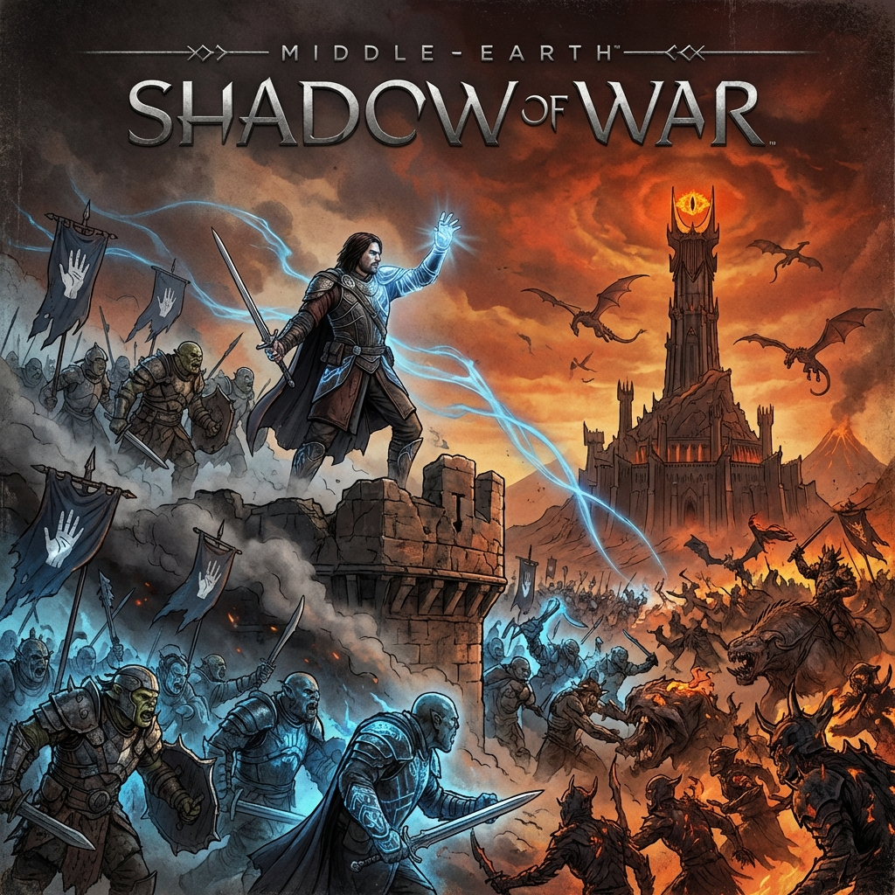

# Middle-Earth: Shadow of War

| |                             |
|--------------------|-----------------------------| 
| Release Date       | 10th Oct 2017           |
| Developer          | Monolith Productions        |
| Publisher          | Warner Bros. Interactive    |
| Genre              | Action RPG, Open World      |
| Status             | Completed                   |
| Time Played        | 46 Hours 42 Minutes         |
| Rating             | ★ ★ ★ ★ ☆                 |
| Platform           | Pirated                     |
| Achievements       | Pirated                     |

## Overview

Middle-Earth: Shadow of War takes everything that made its predecessor great and turns the dial up to eleven. It’s bigger, louder, and more ambitious in every conceivable way. Released in 2017, this sequel expands the Nemesis System into full-blown warfare, allowing you to conquer forts, build armies, and challenge Sauron for dominion over Mordor. After nearly 47 hours, I found it to be a massive, sprawling epic that occasionally collapses under the weight of its own ambition. It’s a fantastic playground of emergent storytelling, held back slightly by pacing issues and a "more is better" philosophy that dilutes some of the original's focused intensity.

## Story & Atmosphere

The story picks up immediately after Shadow of Mordor, with Talion and Celebrimbor forging a new Ring of Power to challenge Sauron. What follows is a narrative that plays fast and loose with Tolkien’s lore—even more so than the first game. We get a humanform Shelob, a different take on the Nazgûl, and plot points that would make a scholar of the Silmarillion weep. However, if you accept it as high-budget fan fiction, it’s an entertaining ride. The stakes are higher, the battles are grander, and the relationship between Talion and Celebrimbor becomes increasingly strained and fascinating.

The atmosphere is more varied this time around. Instead of just ash and gloom, we visit snowy mountain peaks, lush forests, and industrial war factories. Each region feels distinct, populated by different tribes of orcs that bring their own visual flair and combat styles to the table. The scale is impressive—fortresses loom over the landscape, and the sheer number of orcs on screen during a siege is a technical marvel. The voice acting remains top-tier, with Celebrimbor’s imperious commands and the orcs’ cockney banter providing a constant auditory backdrop to the violence.

## Gameplay

The core loop of combat and stealth returns, refined and expanded. Talion moves faster, hits harder, and has access to a dizzying array of new abilities. The double-jump and elven agility make traversing the massive environments a joy. Combat is still deeply satisfying, mixing rhythm-based counters with brutal executions and wraith magic.

But the real star is the expanded Nemesis System. It’s not just about captains anymore; it’s about armies. The new Fortress Assault mechanics are the highlight of the game. You spend time weakening a region’s defenses—assassinating warchiefs, installing your own spies, disabling monuments—before launching a massive cinematic siege to capture the main fortress. Leading your customized army of orcs into battle, breaching the walls, and facing off against the Overlord in his throne room is an adrenaline rush that never really gets old.

The orc variety has been massively improved. Nemeses now have more distinct personalities, classes (like Assassins, Beastmasters, Tanks), and tribal affiliations that affect their gear and abilities. They can cheat death in surprising ways, betray you at the worst possible moments, or save your life just when you think you’re done for. The stories generated here are even crazier than in the first game.

However, the game suffers from bloat. The RPG elements have been deepened with a gear system that feels unnecessary—you’re constantly swapping out swords and armor for minor stat boosts, managing gems, and sifting through loot menus. It breaks the flow of the action. The endgame content, formerly known as the "Shadow Wars," is a bit of a grind. While it has been streamlined since launch (and the controversial microtransactions were removed long ago), it still feels like the game drags on a bit too long after the climax.

## Verdict

After 46 hours and 42 minutes, Middle-Earth: Shadow of War stands as a worthy, if slightly flawed, successor. It successfully evolves the Nemesis System into something grander, offering a strategic layer that makes you feel like a true commander of armies. The fortress sieges are spectacular, and the infinite variety of orc personalities keeps the moment-to-moment gameplay engaging for dozens of hours.

It misses the perfect 5-star mark because it sometimes loses focus. The loot system feels tacked on, the story takes some bizarre turns, and the sheer volume of content can become exhausting. It lacks the tight, cohesive design of Shadow of Mordor, trading focus for scale.

But for anyone who enjoyed the first game, this is a must-play. It gives you more of everything you loved—more orcs to brand, more heads to chop, and bigger battles to fight. It’s a chaotic, violent, and endlessly replayable sandbox that lets you write your own war stories in the land of Shadow.
