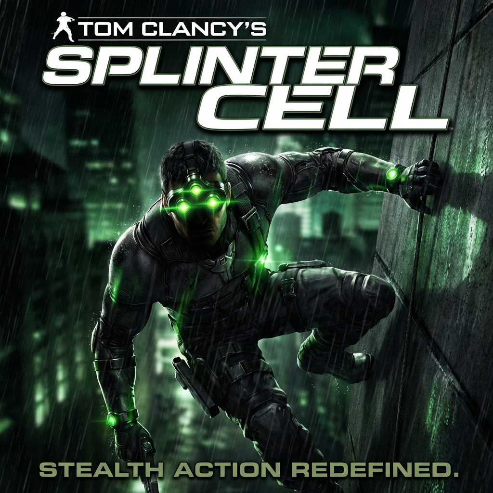

# Tom Clancy's Splinter Cell

| |                             |
|--------------------|-----------------------------| 
| Release Date       | 17th Nov 2002               |
| Developer          | Ubisoft Montreal            |
| Publisher          | Ubisoft                     |
| Genre              | Stealth / Action            |
| Status             | Playing                     |
| Time Played        | 0h 35m                      |
| Start Date         | 26th January 2026           |
| End Date           | -                           |
| Duration           | -                           |
| Rating             | -                           |
| Platform           | Steam                       |
| Achievements       | Not Available               |

## Overview

Tom Clancy's Splinter Cell introduces Sam Fisher, a highly trained operative working for Third Echelon, a secret branch of the NSA. As a Splinter Cell agent, Fisher operates in the shadows, using stealth, gadgets, and precision to complete missions that officially "never happened." The game revolutionized stealth gameplay with its dynamic light and shadow mechanics, where darkness becomes your greatest ally and every light source is a tactical consideration.

## Story & Atmosphere

*(To be filled as I play)*

## Gameplay

*(To be filled as I play)*

## Verdict

*(To be filled upon completion)*

---

## Mission Progress

*(Tracking my journey through the game)*

- [x] **Training**
- [ ] **Mission 1: Georgian Military Base (Georgia)**
- [ ] **Mission 2: Oil Refinery (Georgia)**
- [ ] **Mission 3: Police Station (Georgia)**
- [ ] **Mission 4: Defense Ministry (Georgia)**
- [ ] **Mission 5: Chinese Embassy, Part 1 (Myanmar)**
- [ ] **Mission 6: Chinese Embassy, Part 2 (Myanmar)**
- [ ] **Mission 7: KGB Headquarters (Russia)**
- [ ] **Mission 8: Kalinatek (USA)**
- [ ] **Mission 9: Abattoir (Russia)**
- [ ] **Mission 10: Chinese Embassy, Part 3 (Myanmar)**
- [ ] **Mission 11: Presidential Palace (Azerbaijan)**

**Bonus Missions (PC/Xbox):**
- [ ] **Kola Cell**
- [ ] **Vselka Infiltration**
- [ ] **Vselka Submarine**

## Notes & Observations

*(These are my raw notes from while I was playing—some spoilers involved!)*

### Training Mission
*   **The Future Setting:** Interesting that the story is set in 2004 while the game released in 2002—they're showing us a near-future scenario. Sets up the high-tech gadget vibe perfectly.
*   **Movement Freedom:** Sam Fisher feels SO much more mobile than Agent 47. The movement system is incredibly fluid. I can already imagine all the stealthy approaches I'll be using. Climbing, hanging, split jumps—this is next-level infiltration.
*   **Mechanics Comparison (2002 vs 2002):** Both Hitman 2 and Splinter Cell released in 2002, but the game mechanics here are **much, much superior**. The control responsiveness, the movement options, the environmental interaction—it's a huge leap forward. Of course, I'll reserve final judgment on story, plot, and level design until I finish the game, but mechanically? Splinter Cell wins hands down.
*   **Graphics Issues:** The graphics are trash and immutable. DGVoodoo2 worked wonders for Hitman 2, but it's completely incompatible with Splinter Cell. The best fix I found is manually stretching the game window, but that cuts off information at the edges of the screen sometimes. Annoying, but playable.
