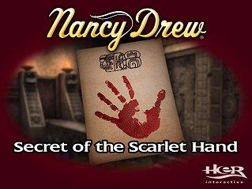
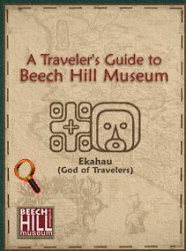
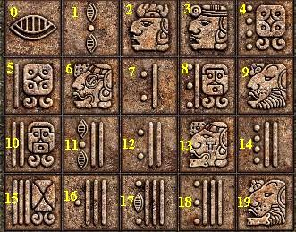
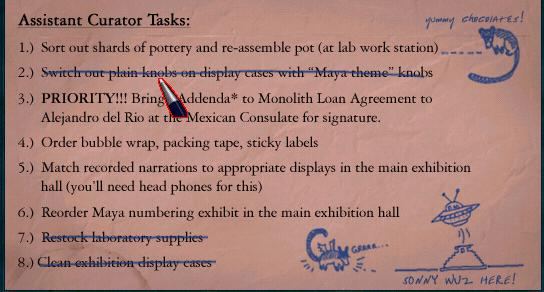

# Nancy Drew: Secret of the Scarlet Hand - Complete Walkthrough

## 🔍 The Mystery of the Scarlet Hand 🔍
*A comprehensive, step-by-step guide to solving the museum mystery*

---

## 📖 Table of Contents

- [General Tips](#general-tips)
- [Part 1: Museum Arrival & Orientation](#part-1-museum-arrival--orientation)
- [Part 2: The Laboratory & First Tasks](#part-2-the-laboratory--first-tasks)
- [Part 3: The Rotunda & Exhibits](#part-3-the-rotunda--exhibits)
- [Part 4: The Theft Investigation](#part-4-the-theft-investigation)
- [Part 5: The Monolith Mystery](#part-5-the-monolith-mystery)
- [Part 6: Uncovering the Scarlet Hand](#part-6-uncovering-the-scarlet-hand)
- [Part 7: The Final Confrontation](#part-7-the-final-confrontation)

---

## General Tips

*   **Controls:** Left-click to move/interact. Right-click to examine items more closely.
*   **Inventory:** Press 'I' or click the briefcase icon to access your inventory.
*   **Documents:** Read every document carefully. They contain crucial clues and phone numbers.
*   **Phone:** Use your cell phone to call numbers found throughout the game.
*   **To-Do List:** Check Nancy's desk in the lab regularly for updated tasks.
*   **Save Often:** Save your game frequently, especially before attempting puzzles.
*   **Difficulty Modes:** Junior Detective offers more hints; Senior Detective provides a greater challenge.

---

## Part 1: Museum Arrival & Orientation

### The Museum Entrance
1.  **Arrival:**
    *   Watch the opening cutscene where Nancy arrives at the Beech Hill Museum.
    *   You'll meet **Taylor Sinclair**, the intern coordinator.
    *   After the conversation, you'll be in the museum rotunda.

2.  **Initial Exploration:**
    *   Look around the rotunda. Note the exhibits and the central monolith.
    *   Try to interact with various exhibits to get familiar with the controls.
    *   Click on the door to Joanna's office (locked for now).

3.  **Meeting Joanna Riggs:**
    *   Go to the hallway on the left side of the rotunda.
    *   Enter the door to **Joanna Riggs' Office**.
    *   Talk to Joanna about all available topics:
        *   "That's right, I'm Nancy Drew"
        *   "Tell me about the museum"
        *   "What will I be doing here?"
        *   "Who else works here?"
    *   She'll give you access to the laboratory and your first tasks.

### The Laboratory
1.  **Finding Your Workspace:**
    *   Exit Joanna's office and turn right.
    *   Go down the hallway to find the **Laboratory**.
    *   Enter the lab - this will be your main workspace.

2.  **Desk Exploration:**
    *   Approach Nancy's desk (the one on the right).
    *   Click on the **To-Do List** to see your current tasks.
    
    *   Open the desk drawer to find:
        *   **Sonny Joon's Notes** (read them - he's obsessed with aliens!)
        *   **Museum Map**
    *   Pick up the **Pencil** from the desk.

3.  **Lab Equipment:**
    *   Examine the **Microscope** on the left desk.
    *   Check out the **Computer** (you'll use this later).
    *   Note the **Filing Cabinets** and **Bookshelves**.

---

## Part 2: The Laboratory & First Tasks

### Task 1: Organize the Exhibits

1.  **Understanding the Task:**
    *   Check your To-Do List. Your first task is to organize the museum exhibits.
    *   You need to match artifacts with their correct descriptions and time periods.
    

2.  **The Rotunda Exhibits:**
    *   Go back to the rotunda.
    *   There are several exhibits labeled A through H.
    *   Click on each exhibit to read the current description.

3.  **Research Time:**
    *   Return to the lab and use the **Computer**.
    *   Click on "Museum Database" to access information about artifacts.
    *   Read about each artifact carefully, noting:
        *   Time period
        *   Cultural significance
        *   Physical description

4.  **The Solution:**
    *   Match the exhibits as follows:
        *   **Exhibit A:** Offering Bowl (ca. 850 CE)
        *   **Exhibit B:** Cacao Pot (ca. 900 CE)
        *   **Exhibit C:** Jade Necklace (ca. 600 CE)
        *   **Exhibit D:** Obsidian Blade (ca. 700 CE)
        *   **Exhibit E:** Ceremonial Mask (ca. 800 CE)
        *   **Exhibit F:** Stone Carving (ca. 650 CE)
        *   **Exhibit G:** Pottery Vessel (ca. 750 CE)
        *   **Exhibit H:** Jade Figurine (ca. 550 CE)

5.  **Updating the Exhibits:**
    *   Go to each exhibit in the rotunda.
    *   Click on the information placard.
    *   Select the correct description from the dropdown menu.
    *   Confirm your selection.

### Task 2: Assemble the Broken Vase

1.  **Finding the Vase Pieces:**
    *   Check your To-Do List for this task.
    *   Go to the **Storage Room** (door near the lab).
    *   On the shelves, you'll find boxes containing pottery fragments.

2.  **The Vase Puzzle:**
    *   Click on the table in the storage room.
    *   You'll see broken pottery pieces.
    
    *   **Puzzle Solution:**
        *   This is a jigsaw puzzle. Rotate and place pieces to form a complete vase.
        *   Start with corner and edge pieces.
        *   Look for matching patterns and colors.
        *   The vase should show a Mayan scene when complete.

3.  **Completing the Task:**
    *   Once assembled, take a photo of the vase (automatic).
    *   Return to your desk and mark the task as complete.

### Task 3: Acquire Headphones

1.  **The Headphone Cabinet:**
    *   In the lab, notice the locked cabinet near the audio equipment.
    *   You need a key to open it.

2.  **Finding the Doorknob:**
    *   Go to the **Hallway** near Joanna's office.
    *   Look at the supply closet door - it's missing a doorknob.
    *   Check the floor nearby - pick up the **Doorknob**.

3.  **Opening the Cabinet:**
    *   Return to the lab.
    *   Use the **Doorknob** on the headphone cabinet.
    *   Open it and take the **Headphones**.
    *   You'll use these to listen to audio recordings later.

---

## Part 3: The Rotunda & Exhibits

### Meeting the Staff

1.  **Henrik Van Der Hune:**
    *   Go to the rotunda during the day.
    *   You'll meet **Henrik**, the Mayan expert.
    *   Talk to him about all topics:
        *   "Who are you?"
        *   "What do you do here?"
        *   "Tell me about Mayan culture"
        *   "What's the monolith?"
    *   He's knowledgeable but a bit pompous.

2.  **Alejandro del Rio:**
    *   You'll encounter **Alejandro** in the museum.
    *   He's the museum employee and handyman.
    *   Talk to him about:
        *   "What's your job here?"
        *   "Do you know anything about the theft?"
        *   "Tell me about yourself"
    *   He seems friendly but nervous.

### The Monolith

1.  **Examining the Monolith:**
    *   The central piece in the rotunda is the **Monolith**.
    *   It's a large stone carving with Mayan glyphs.
    *   Click on it to examine it closely.
    

2.  **The Glyphs:**
    *   Note the various symbols carved into the stone.
    *   You'll need to decipher these later.
    *   Take mental notes of the patterns.

3.  **The Loan Agreement:**
    *   In Joanna's office, check the filing cabinet.
    *   Find the **Loan Agreement** between Mexico and the museum.
    *   Read it carefully - note that it's unsigned by the Mexican Cultural Attaché.

---

## Part 4: The Theft Investigation

### The Crime Scene

1.  **The Stolen Artifact:**
    *   You'll learn that a jade carving of **King Pacal** was stolen.
    *   The thief left a mysterious **red handprint** at the scene.
    *   This is the signature of the "Scarlet Hand."

2.  **Analyzing the Handprint:**
    *   Go to the lab and use the **Microscope**.
    *   Examine the sample of the red substance.
    
    *   **Discovery:** It's not blood - it's **Cinnabar** (mercury sulfide).
    *   The Maya used cinnabar to highlight carvings.

3.  **The Red Hand Letter:**
    *   Check your desk - you'll receive a threatening letter.
    *   It's signed with a red handprint.
    *   The letter contains cryptic clues about the theft.

### Task 4: Analyze the Letter

1.  **The Cipher:**
    *   The letter contains encoded text.
    *   You need to decipher it using a substitution cipher.

2.  **Finding the Key:**
    *   In the lab, check the bookshelves.
    *   Find the book on **Mayan Glyphs and Numbers**.
    *   This will help you decode the message.

3.  **Decoding Process:**
    *   Use the computer in the lab.
    *   Open the "Cipher Tool" program.
    *   Input the encoded text from the letter.
    *   Use the Mayan number system as the key:
        *   Dots = 1
        *   Bars = 5
        *   Shell = 0
    *   **Solution:** The decoded message reveals a warning about the museum's secrets.

### Investigating Suspects

1.  **Questioning Henrik:**
    *   Talk to Henrik about the theft.
    *   Ask him: "Where were you when the artifact was stolen?"
    *   He provides an alibi but seems defensive.
    *   Ask about his research - he's studying the monolith.

2.  **Questioning Alejandro:**
    *   Find Alejandro and ask about the theft.
    *   He mentions seeing someone suspicious near the storage room.
    *   Ask him about his background - he's from Mexico.

3.  **Checking Security:**
    *   In Joanna's office, check the security logs.
    *   Note the times when people entered and exited the museum.
    *   Cross-reference with the time of the theft.

---

## Part 5: The Monolith Mystery

### Task 5: Decipher the Monolith

1.  **The Glyph Puzzle:**
    *   Return to the monolith in the rotunda.
    *   You need to translate the glyphs.
    *   Use your research materials from the lab.

2.  **Research Materials:**
    *   Go to the lab computer.
    *   Access the "Mayan Glyph Database."
    *   Study the meanings of different glyphs:
        *   **Itzamna** - Supreme God
        *   **Ixchel** - Moon Goddess
        *   **Ahau Kin** - Sun God
        *   **Chac** - Rain God
        *   **Pacal** - Shield/King

3.  **Translation Process:**
    *   Click on each glyph on the monolith.
    *   Match it with the correct meaning from your research.
    
    *   **Solution Pattern:**
        *   Top row: Gods (Itzamna, Ixchel, Ahau Kin)
        *   Middle row: Elements (Rain, Sun, Moon)
        *   Bottom row: Rulers (Pacal, dates, locations)

4.  **The Hidden Message:**
    *   Once translated correctly, the monolith reveals a hidden compartment.
    *   Click on the specific glyph sequence to open it.
    *   Inside, you find a **Secret Document**.

### The Secret Document

1.  **Reading the Document:**
    *   The document is in Spanish and Mayan.
    *   It references a hidden treasure or artifact.
    *   It mentions "the hand that protects."

2.  **Translation Help:**
    *   Use the computer's translation program.
    *   Or call the Mexican Consulate (number in your notes).
    *   **Translation:** The document speaks of a guardian artifact that protects sacred items.

3.  **The Connection:**
    *   This document is connected to the stolen Pacal carving.
    *   The Scarlet Hand is trying to find this guardian artifact.

---

## Part 6: Uncovering the Scarlet Hand

### Task 6: The Consulate Visit

1.  **Preparing the Documents:**
    *   Check your To-Do List - you need to bring documents to the Mexican Consulate.
    *   Gather the **Loan Agreement** from Joanna's office.
    *   Make copies of the **Secret Document**.

2.  **Metro Station:**
    *   Exit the museum through the main entrance.
    *   Go to the **Metro Station** (follow the street signs).
    *   Use the metro map to navigate.
    

3.  **The Consulate:**
    *   Take the metro to the consulate stop.
    *   Enter the **Mexican Consulate** building.
    *   Talk to the receptionist.

4.  **Meeting the Attaché:**
    *   Present your documents to the **Cultural Attaché**.
    *   Discuss the loan agreement.
    *   **Important:** He reveals he never signed the agreement!
    *   Someone forged his signature.

### The Forgery Investigation

1.  **Handwriting Analysis:**
    *   Return to the museum lab.
    *   Use the computer's handwriting analysis tool.
    *   Compare the signature on the loan agreement with known samples.

2.  **Collecting Samples:**
    *   You need handwriting samples from all suspects.
    *   **Henrik's Sample:** Check his research notes in his office.
    *   **Alejandro's Sample:** Find his maintenance logs.
    *   **Joanna's Sample:** Her signature is on various museum documents.
    *   **Taylor's Sample:** Check intern coordination paperwork.

3.  **The Analysis:**
    *   Input all samples into the computer program.
    *   Compare stroke patterns, pressure, and letter formation.
    *   **Result:** The forgery matches one of the suspects' handwriting.

### Following the Clues

1.  **The Storage Room:**
    *   Search the storage room more thoroughly.
    *   Move boxes to reveal a hidden area.
    *   Find **Stolen Artifact Fragments** hidden behind supplies.

2.  **The Secret Passage:**
    *   In the rotunda, examine the wall near the monolith.
    *   Press the correct sequence of glyphs (based on your earlier translation).
    *   **Sequence:** Pacal → Shield → Hand
    *   A secret door opens, revealing a passage.

3.  **The Hidden Room:**
    *   Enter the passage carefully.
    *   You'll find a small room with:
        *   **The Stolen Pacal Carving**
        *   **Documents about the Scarlet Hand**
        *   **Evidence linking to the thief**

---

## Part 7: The Final Confrontation

### Gathering Evidence

1.  **Compiling Your Case:**
    *   Return to the lab.
    *   Organize all evidence:
        *   Forged signature analysis
        *   Stolen artifact location
        *   Scarlet Hand documents
        *   Suspect alibis and inconsistencies

2.  **The Motive:**
    *   Review all documents to understand the motive.
    *   The thief wanted to:
        *   Steal valuable artifacts
        *   Sell them on the black market
        *   Use the Scarlet Hand legend as a cover

3.  **Identifying the Culprit:**
    *   Based on all evidence, determine who the thief is.
    *   Consider:
        *   Who had access to all areas?
        *   Who could forge the signature?
        *   Who knew about the secret passage?
        *   Who had the opportunity?

### The Confrontation

1.  **Setting the Trap:**
    *   Call a meeting with all suspects in the rotunda.
    *   Present your evidence systematically.
    *   Watch for reactions.

2.  **The Accusation:**
    *   Confront the guilty party with your evidence.
    *   They will initially deny it.
    *   Present the final, irrefutable proof.

3.  **The Confession:**
    *   Under pressure, the thief confesses.
    *   They explain their motive and plan.
    *   The authorities are called.

### Resolution

1.  **Recovering the Artifacts:**
    *   Help the police recover all stolen items.
    *   The Pacal carving is returned to its proper place.
    *   The museum's reputation is saved.

2.  **Joanna's Gratitude:**
    *   Joanna thanks you for solving the case.
    *   She offers you a permanent position (which Nancy politely declines).
    *   The museum can now proceed with the exhibition.

3.  **Final Cutscene:**
    *   Watch the ending cutscene.
    *   Nancy reflects on the case and what she learned about Mayan culture.
    *   The game ends with Nancy leaving the museum, ready for her next adventure.

---

## Additional Puzzles & Mini-Games

### The Mayan Number System

*   **Understanding the System:**
    *   Dots = 1
    *   Bars = 5
    *   Shell = 0
    *   Numbers are written vertically

*   **Common Puzzles:**
    *   Converting modern numbers to Mayan glyphs
    *   Solving mathematical equations using Mayan numbers
    *   Decoding dates in the Mayan calendar

### The Tzolkin Calendar

*   **The 260-Day Cycle:**
    *   The calendar combines 20 day names with 13 numbers.
    *   Used for religious and ceremonial purposes.

*   **Puzzle Solutions:**
    *   Match dates with events
    *   Calculate future dates based on cycles
    *   Identify auspicious days for ceremonies

### Audio Recordings

*   **Using the Headphones:**
    *   Listen to recorded lectures about Mayan culture.
    *   Take notes on important information.
    *   Use clues from recordings to solve puzzles.

*   **Key Recordings:**
    *   Henrik's lecture on Pacal the Great
    *   Joanna's notes on museum security
    *   Alejandro's maintenance reports

---

## Phone Numbers & Contacts

*   **Museum Main Line:** 555-MUSEUM (555-6873)
*   **Mexican Consulate:** 555-9963
*   **Taylor Sinclair:** 555-INTERN (555-4683)
*   **Emergency Contact:** 555-HELP (555-4357)

---

## Important Items & Inventory

### Essential Items
*   **Pencil** - For taking notes and sketches
*   **Headphones** - For listening to audio recordings
*   **Museum Map** - Navigate the museum
*   **Cell Phone** - Make calls and receive messages
*   **Camera** - Document evidence and artifacts

### Key Documents
*   **Loan Agreement** - Reveals the forgery
*   **Secret Document** - Found in the monolith
*   **Scarlet Hand Letter** - Contains cipher
*   **Sonny Joon's Notes** - Background information
*   **Research Materials** - Mayan culture and glyphs

### Evidence Items
*   **Cinnabar Sample** - From the red handprint
*   **Artifact Fragments** - From the storage room
*   **Handwriting Samples** - For analysis
*   **Security Logs** - Timing and access records

---

## Tips for Success

### General Strategy
*   **Talk to Everyone:** Exhaust all dialogue options with every character.
*   **Read Everything:** Documents contain crucial clues and context.
*   **Take Notes:** Keep track of numbers, codes, and important information.
*   **Save Regularly:** Before attempting puzzles or making accusations.

### Puzzle-Solving
*   **Use Your Resources:** The computer and books in the lab are invaluable.
*   **Think Logically:** Most puzzles follow clear patterns.
*   **Don't Rush:** Take time to understand what each puzzle is asking.
*   **Trial and Error:** Some puzzles require experimentation.

### Investigation
*   **Be Thorough:** Search every location completely.
*   **Question Everything:** If something seems odd, investigate further.
*   **Connect the Dots:** Look for patterns and connections between clues.
*   **Trust Your Instincts:** Nancy's observations are usually correct.

---

*(Walkthrough created with reference to the Mystery Manor Adventure guide and adapted for comprehensive gameplay coverage)*
